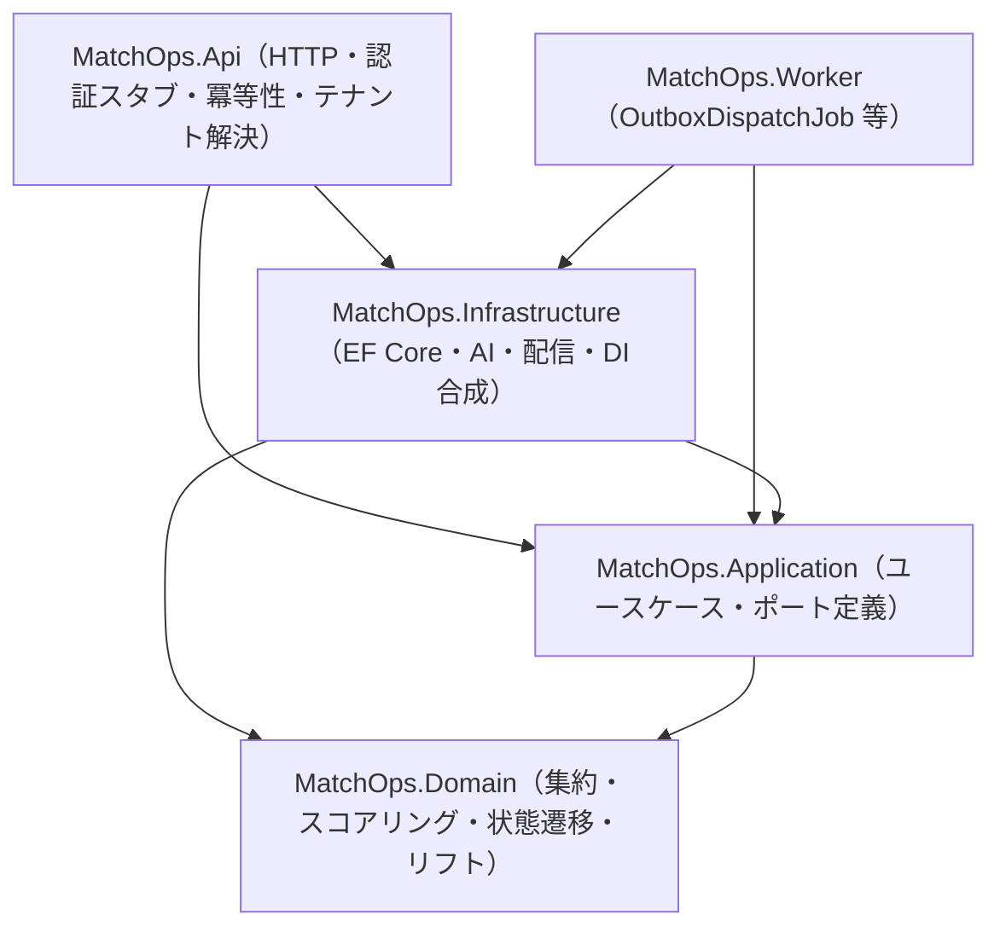
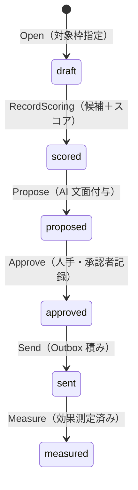

# アーキテクチャ（as-built）

DDD ライト + クリーンアーキテクチャを**モジュラーモノリス + 非同期ワーカー**で実装している（ADR-0002）。

## 1. 技術スタック

| 区分 | 採用 |
|---|---|
| ランタイム/言語 | .NET 10 / C#（nullable 有効・ImplicitUsings・file-scoped namespace） |
| API | ASP.NET Core（Controller ベース）+ `Microsoft.AspNetCore.OpenApi` + Scalar UI（`/scalar`） |
| 永続化 | EF Core 10 + `Npgsql.EntityFrameworkCore.PostgreSQL`（PostgreSQL 18） |
| ワーカー | `Microsoft.Extensions.Hosting`（`BackgroundService`） |
| AI | OpenAI 互換 Chat Completions（`HttpClient` 直叩き。SDK 非依存） |
| テスト | xUnit / Testcontainers(PostgreSQL) / WireMock.Net / `WebApplicationFactory` |
| 規約強制 | `Directory.Build.props`：警告をエラー化（CS1591 含む）、NuGet Audit、`dotnet format` |

## 2. レイヤー構成と依存方向



- **Domain**：他レイヤーに依存しない（BCL のみ。EF/ASP.NET/FluentValidation 等は持ち込まない）。
- **Application**：`Domain` のみ参照。ユースケースとポート（インターフェース）を定義。
- **Infrastructure**：`Domain` と `Application` を参照。ポートの実装と DI 合成（`AddInfrastructure`）。
- **Api / Worker**：`Application` と `Infrastructure` を参照（合成ルート・エントリポイント）。
- モジュール間連携は **Application のインターフェース経由**。別モジュールの Domain 型を跨いで直接参照しない。

## 3. プロジェクト構成

```
src/
├── MatchOps.Domain          ── Customers / Scheduling / Catalog / Matching / Experiments / Common
├── MatchOps.Application      ── 各モジュールのユースケース・ポート（Common / Tenancy / Ai / Notifications / Experiments ...）
├── MatchOps.Infrastructure   ── Persistence(EF) / Ai / Notifications / Matching / Experiments / Tenancy / Time / DependencyInjection
├── MatchOps.Api              ── Controllers / Contracts(DTO) / Idempotency / Tenancy / Program.cs
└── MatchOps.Worker           ── OutboxDispatchJob / Program.cs
tests/
├── MatchOps.Domain.Tests          （DB 不要・単体）
├── MatchOps.Application.Tests     （手書きテストダブル）
├── MatchOps.Infrastructure.Tests  （Testcontainers PostgreSQL / WireMock）
├── MatchOps.Api.Tests             （WebApplicationFactory）
└── MatchOps.IntegrationTests
infra/
├── docker-compose.yml        ── postgres / redis / metabase（ローカル開発）
├── db/audit_logs_revoke.sql  ── audit_logs の UPDATE/DELETE REVOKE（運用適用）
└── analytics/lift_dashboard.sql ── リフト集計（Metabase 用）
```

## 4. モジュールと責務

| モジュール | Domain | Application | Infrastructure |
|---|---|---|---|
| Customers | `Customer`（オプトイン・来店履歴・PII ハッシュ）, `CustomerActivity`, `ContactHash` | — | EF マッピング |
| Scheduling | `Resource`, `TimeSlot`（状態機械）, `TimeRange` | — | EF マッピング |
| Catalog | `Offer`（値引き上限・適用条件）, `DiscountCap` | — | EF マッピング |
| Matching | `MatchingCampaign`（状態機械）, `MatchingEngine`, `ScoringPolicy`/`ScoreBreakdown`, `MatchingCandidate` | `MatchingCampaignService`（run/propose/approve/send）, `MatchingCampaignQueries`, ポート群, `AiProposalServiceAdapter` | `EfMatchingCampaignRepository`, `EfUnitOfWork`, `ConfigurationMatchingPolicyProvider`, `PlaceholderCampaignCandidateSource` |
| Ai | — | `IAiProposalService`（要約/文面/結果コメント）, 匿名化 DTO | `OpenAiProposalService`（プロンプト構築隔離・PII 非送出・上限検証・フォールバック） |
| Notifications | — | `IOutboxWriter`, `INotificationSender`, `INotificationEligibility`, `IOutboxDispatcher`, DTO | `EfOutboxWriter`, `LoggingNotificationSender`, `CustomerNotificationEligibility`, `OutboxDispatcher` |
| Experiments | `ExperimentArm`, `HoldoutAssignmentPolicy`, `ExperimentAssignment`, `ArmOutcome`, `LiftResult` | `ExperimentService`（割当）, `ExperimentQueries`（リフト）, ポート群 | `EfExperimentAssignmentRepository`, `EfConversionReadStore` |
| Tenancy | — | `ITenantContext` | `NullTenantContext`（背景処理既定） |

## 5. 横断的関心事（実装済み）

### 5.1 テナント分離（ADR-0006）
- すべての業務テーブルに `tenant_id`。`MatchOpsDbContext` の **Global Query Filter** で `tenant_id == 現在テナント` を機械的に強制。
- テナント解決は `ITenantContext`：Api は `RequestContext`（`X-Tenant-Id` ヘッダ由来・リクエストスコープ）、未登録環境（Worker）は `NullTenantContext`（テナント未解決＝何も返さない安全側）を `TryAdd` で既定登録。
- 背景処理（`OutboxDispatcher` 等）はテナント横断のため `IgnoreQueryFilters` で全テナントを処理する。

### 5.2 冪等性（CLAUDE.md §10.1）
- `IdempotencyFilter`（Action フィルタ）を run/propose/approve/send に適用。`Idempotency-Key` 必須（欠如→400）。
- 同一キー＋同一本文 → 保存済みレスポンスを再生（再実行しない＝副作用一度きり）。同一キー＋異なる本文 → 409。
- ストアはテナントでスコープ。Phase 0 は `InMemoryIdempotencyStore`（24h TTL）。再生本文は MVC と同じ camelCase。

### 5.3 承認境界（ADR-0004 Human-in-the-loop）
- `MatchingCampaign` は `approved`（人手）を経ずに `sent` へ遷移できない（Domain で不正遷移を `DomainException`）。
- Application も `SendAsync` で状態を確認し、未承認は例外でなく `Result.Failure("not_approved")`（→409）を返す。

### 5.4 PII / AI 境界（ADR-0005）
- LLM へ渡す入力 DTO は集約・匿名化のみ（識別子・連絡先を型として持たない）。プロンプト構築は `Infrastructure/Ai` に隔離。
- 連絡先は `phone_hash` / `email_hash`（ハッシュ）で保持。配信・ログ・結果レスポンスに連絡先平文を出さない。

### 5.5 Outbox（design.md §10）
- 配信は DB 状態変更と同一トランザクションで `outbox_messages` に積む（`IUnitOfWork`）。実送信は `OutboxDispatchJob`（Worker）。失敗は指数バックオフ・最大試行で恒久失敗。

### 5.6 時刻・結果型
- 本番コードで `DateTime.UtcNow` を直呼びしない。`IClock`（`SystemClock`）経由。Domain には時刻をパラメータで渡す。
- ユースケースの想定失敗は例外でなく `Result` / `Result<T>`（エラーコード＋日本語メッセージ、PII 非含）。

## 6. API（実装済みエンドポイント）

| メソッド | パス | 説明 | 冪等 | 主なレスポンス |
|---|---|---|---|---|
| POST | `/api/campaigns/run` | 候補抽出＋スコア（draft→scored） | 要 | 200 `{campaignId}` / 400 / 422 |
| POST | `/api/campaigns/{id}/propose` | AI 提案生成（scored→proposed） | 要 | 204 / 404 / 409 |
| POST | `/api/campaigns/{id}/approve` | 人手承認（proposed→approved） | 要 | 204 / 404 / 409 / 422 |
| POST | `/api/campaigns/{id}/send` | 配信＝Outbox 積み（approved→sent） | 要 | 204 / 404 / 409 |
| GET | `/api/campaigns/{id}/results` | 結果概況（PII 非含） | — | 200 / 404 |
| GET | `/health` | 死活確認 | — | 200 |
| GET | `/openapi/v1.json`, `/scalar` | OpenAPI / API リファレンス UI（Development） | — | 200 |

- 認証スタブ：`/api` 配下は `X-Tenant-Id`（GUID）必須（欠如→401）。`X-User-Id` は承認者として任意。
- `Result` → HTTP 写像：`campaign_not_found`→404、`not_approved`/`invalid_state`→409、その他検証→422。

## 7. 施策の状態機械（MatchingCampaign）



- `run` = `Open` + `RecordScoring`。`propose`/`approve`/`send` は各ユースケースに対応。`measured` への遷移は Domain に実装済みだが API 未露出（効果測定運用は Phase 1）。
