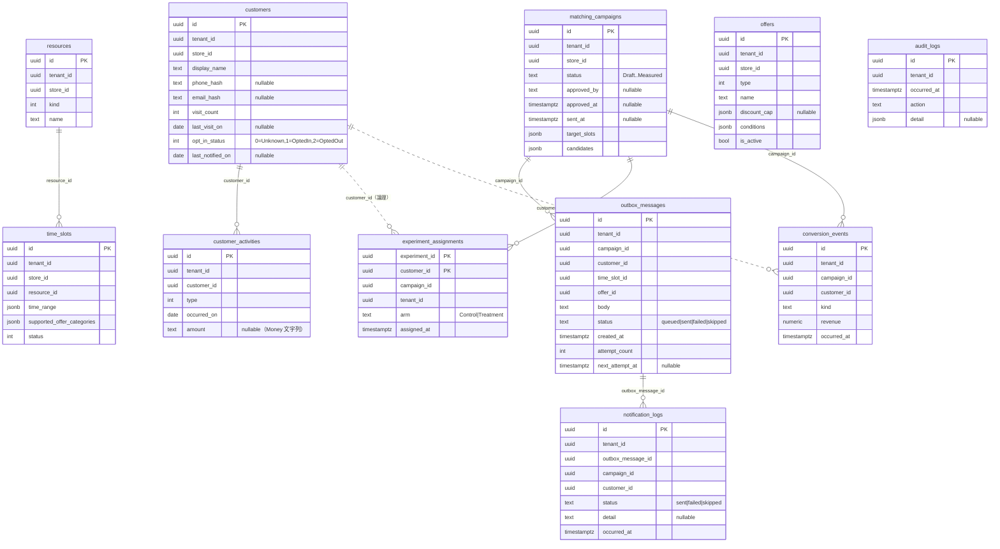

# データベース仕様（as-built）

PostgreSQL 18 / EF Core 10（Npgsql）。マイグレーション：`InitialCreate` → `AddMatchingCampaignAndOutbox` → `AddNotificationLogsAndOutboxRetry` → `AddExperimentsAndConversions`。

## 共通方針

- すべての業務テーブルに `tenant_id`（uuid）。読み書きは Global Query Filter で `tenant_id` スコープを機械的に強制（ADR-0006）。`tenant_id` にインデックス。
- 主キーは特記なき限り `id`（uuid）。強い型 ID（`CustomerId` 等）は uuid に変換して保存。
- **テーブル間に FK 制約は張っていない**（`tenant_id` / `store_id` は不変の opaque 識別子。集約跨ぎの参照〔campaign↔customer 等〕も論理参照）。下記 ER 図の関連は**論理関連**。
- 複合値オブジェクトは `jsonb` 列に保存（`time_range` / `supported_offer_categories` / `discount_cap` / `conditions` / `target_slots` / `candidates`）。
- 連絡先は `phone_hash` / `email_hash`（ハッシュ）。`tenants` / `stores` テーブルは未作成（識別子のみ。Phase 1 で必要に応じ昇格）。

## ER 図（論理関連）

## テーブル仕様

### customers（顧客）
| 列 | 型 | 必須 | 説明 |
|---|---|---|---|
| id | uuid | ✓ | PK |
| tenant_id | uuid | ✓ | テナント（idx） |
| store_id | uuid | ✓ | 所属店舗 |
| display_name | text | ✓ | 表示名 |
| phone_hash | text | | 電話番号ハッシュ（PII 非平文） |
| email_hash | text | | メールハッシュ（PII 非平文） |
| visit_count | int | ✓ | 来店回数 |
| last_visit_on | date | | 最終来店日 |
| opt_in_status | int | ✓ | 配信同意（0=Unknown / 1=OptedIn / 2=OptedOut） |
| last_notified_on | date | | 最終通知日（頻度制御） |

### customer_activities（来店・注文等の履歴, append-only）
| 列 | 型 | 必須 | 説明 |
|---|---|---|---|
| id | uuid | ✓ | PK |
| tenant_id | uuid | ✓ | テナント（idx） |
| customer_id | uuid | ✓ | 顧客（idx） |
| type | int | ✓ | 種別（来店/注文/施術/予約/キャンセル等） |
| occurred_on | date | ✓ | 発生日 |
| amount | text | | 金額（`Money` の「金額 通貨」文字列） |

### resources（席・スタッフ等の供給リソース）
| 列 | 型 | 必須 | 説明 |
|---|---|---|---|
| id | uuid | ✓ | PK |
| tenant_id | uuid | ✓ | テナント（idx） |
| store_id | uuid | ✓ | 所属店舗 |
| kind | int | ✓ | 種別（席/スタッフ等） |
| name | text | ✓ | 名称 |

### time_slots（空き枠）
| 列 | 型 | 必須 | 説明 |
|---|---|---|---|
| id | uuid | ✓ | PK |
| tenant_id | uuid | ✓ | テナント（idx） |
| store_id | uuid | ✓ | 所属店舗 |
| resource_id | uuid | ✓ | リソース（idx） |
| time_range | jsonb | ✓ | 時間範囲 `{Start, End}`（DateTimeOffset） |
| supported_offer_categories | jsonb | ✓ | 対応 Offer 種別タグの集合 |
| status | int | ✓ | 状態（Open/Hold/Booked 等） |

### offers（メニュー/コース/クーポン）
| 列 | 型 | 必須 | 説明 |
|---|---|---|---|
| id | uuid | ✓ | PK |
| tenant_id | uuid | ✓ | テナント（idx） |
| store_id | uuid | ✓ | 所属店舗 |
| type | int | ✓ | 種別（メニュー/コース/クーポン） |
| name | text | ✓ | 名称 |
| discount_cap | jsonb | | 値引き上限 `{Kind, MaxAmount, MaxCurrency, MaxRate}` |
| conditions | jsonb | ✓ | 適用条件 `{Days[], Segments[]}` |
| is_active | bool | ✓ | 有効フラグ |

### matching_campaigns（施策）
| 列 | 型 | 必須 | 説明 |
|---|---|---|---|
| id | uuid | ✓ | PK |
| tenant_id | uuid | ✓ | テナント（idx） |
| store_id | uuid | ✓ | 所属店舗 |
| status | text | ✓ | 状態（Draft/Scored/Proposed/Approved/Sent/Measured） |
| approved_by | text | | 承認者（人手承認時） |
| approved_at | timestamptz | | 承認日時 |
| sent_at | timestamptz | | 配信日時 |
| target_slots | jsonb | ✓ | 対象空き枠 ID 配列 |
| candidates | jsonb | ✓ | 候補配列 `[{CustomerId, TimeSlotId, OfferId, Contributions{}, ProposalReason}]` |

### experiment_assignments（ホールドアウト割当）
| 列 | 型 | 必須 | 説明 |
|---|---|---|---|
| experiment_id | uuid | ✓ | 複合 PK |
| customer_id | uuid | ✓ | 複合 PK（実験×顧客で一意） |
| campaign_id | uuid | ✓ | 対象施策（idx） |
| tenant_id | uuid | ✓ | テナント（idx） |
| arm | text | ✓ | `Control`（非配信追跡）/ `Treatment`（配信） |
| assigned_at | timestamptz | ✓ | 割当日時 |

### conversion_events（成果）
| 列 | 型 | 必須 | 説明 |
|---|---|---|---|
| id | uuid | ✓ | PK |
| tenant_id | uuid | ✓ | テナント（idx） |
| campaign_id | uuid | ✓ | 関連施策（idx） |
| customer_id | uuid | ✓ | CV 顧客 |
| kind | text | ✓ | 成果種別（visit/reservation/coupon 等） |
| revenue | numeric | ✓ | 売上 |
| occurred_at | timestamptz | ✓ | 発生日時 |

> 記録（取込）は Phase 1。本テーブルはリフト集計（読み取り）と将来の取込のために用意。

### outbox_messages（配信 Outbox）
| 列 | 型 | 必須 | 説明 |
|---|---|---|---|
| id | uuid | ✓ | PK |
| tenant_id | uuid | ✓ | テナント（idx） |
| campaign_id | uuid | ✓ | 配信元施策 |
| customer_id | uuid | ✓ | 配信先（連絡先は実送信時に解決） |
| time_slot_id | uuid | ✓ | 対象枠 |
| offer_id | uuid | ✓ | 提案 Offer |
| body | text | ✓ | 配信文面（差し込み済み・PII 非含） |
| status | text | ✓ | `queued`/`sent`/`failed`/`skipped`（idx） |
| created_at | timestamptz | ✓ | 積み込み日時 |
| attempt_count | int | ✓ | 試行回数 |
| next_attempt_at | timestamptz | | 次回試行可能時刻（指数バックオフ） |

### notification_logs（配信ログ）
| 列 | 型 | 必須 | 説明 |
|---|---|---|---|
| id | uuid | ✓ | PK |
| tenant_id | uuid | ✓ | テナント（idx） |
| outbox_message_id | uuid | ✓ | 対象 Outbox メッセージ |
| campaign_id | uuid | ✓ | 施策（idx） |
| customer_id | uuid | ✓ | 顧客（PII 非含） |
| status | text | ✓ | `sent`/`failed`/`skipped` |
| detail | text | | 失敗理由・スキップ理由（PII・シークレット非含） |
| occurred_at | timestamptz | ✓ | 記録日時 |

### audit_logs（監査ログ, append-only）
| 列 | 型 | 必須 | 説明 |
|---|---|---|---|
| id | uuid | ✓ | PK |
| tenant_id | uuid | ✓ | テナント（idx） |
| occurred_at | timestamptz | ✓ | 発生日時 |
| action | text | ✓ | 操作種別（例: `campaign.approved`） |
| detail | jsonb | | 付帯情報 |

> アプリロールからの `UPDATE`/`DELETE` 剥奪は運用スクリプト `infra/db/audit_logs_revoke.sql` で適用（マイグレーションの可搬性のため分離）。操作記録の書き込み連携は Phase 1。
