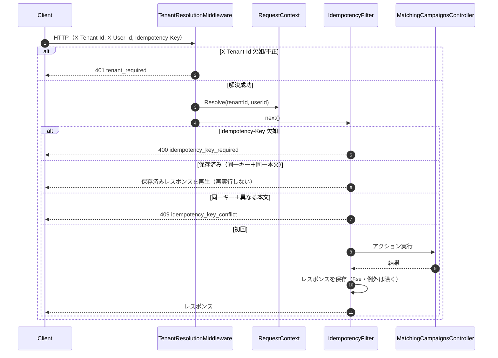
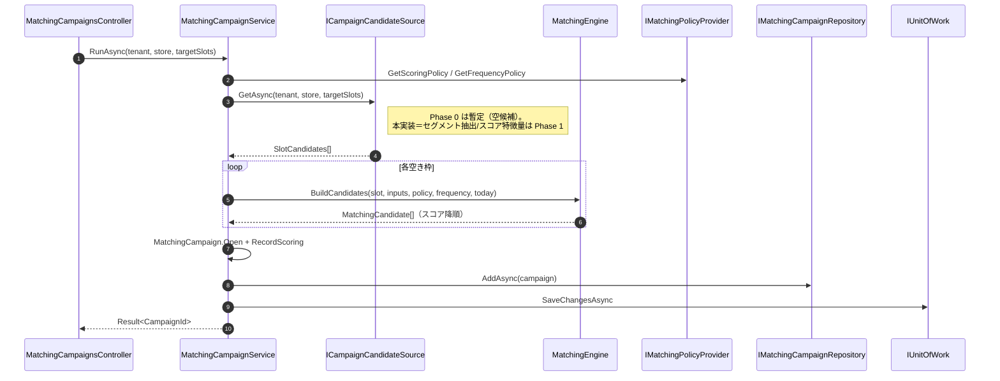
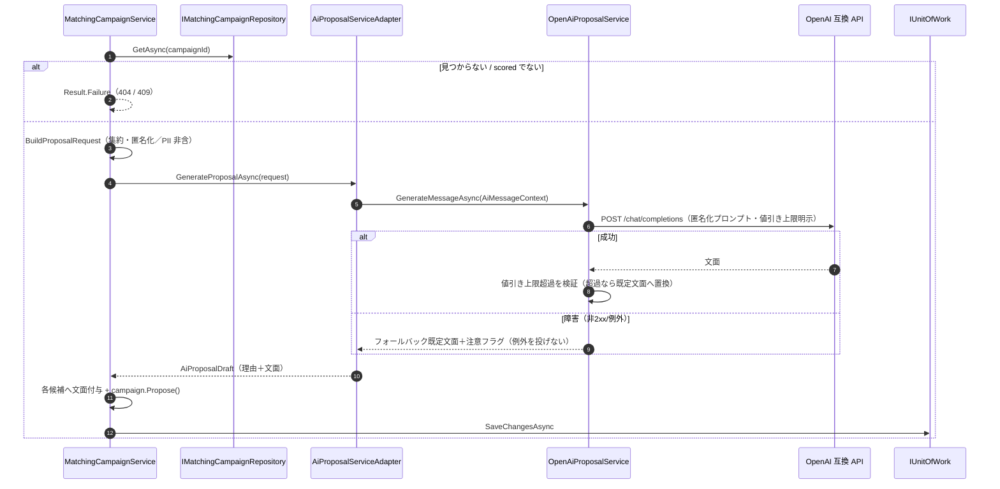
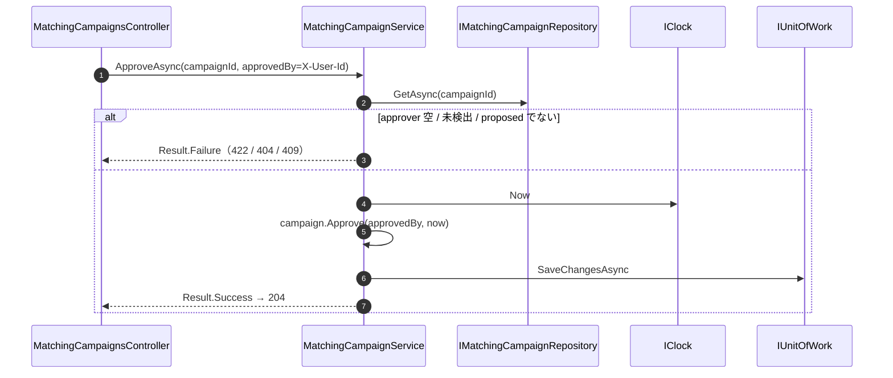
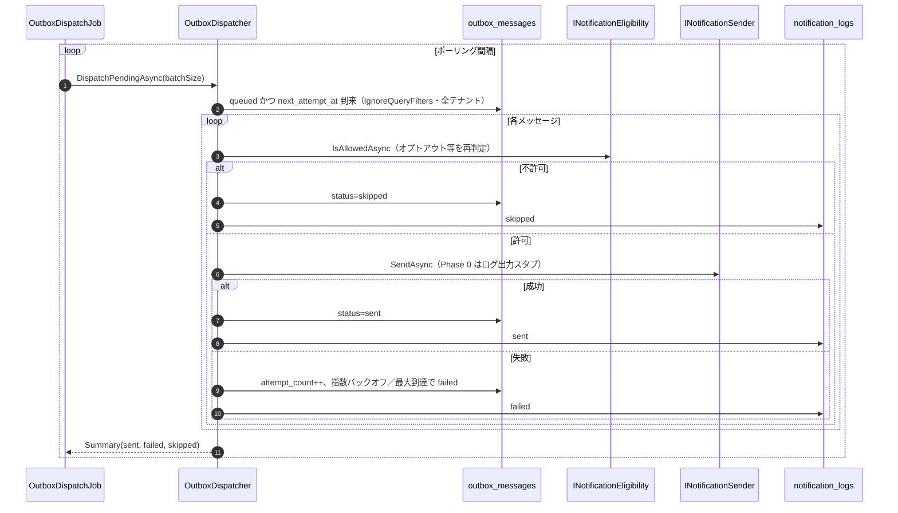
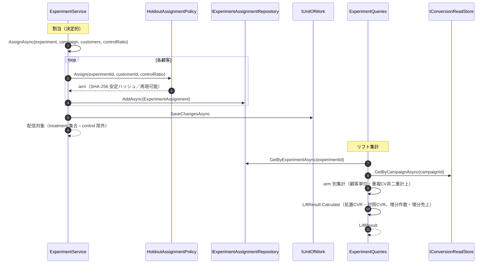

# シーケンス図（as-built）

主要ユースケースの実装フロー。参加者はクラス／コンポーネント名（実装どおり）。

## 0. 横断：テナント解決と冪等性（/api 配下の共通前処理）



## 1. run（候補抽出＋スコアリング, draft→scored）



## 2. propose（AI 提案生成, scored→proposed・PII 非送出）



## 3. approve（人手承認, proposed→approved）



## 4. send（配信＝Outbox 積み, approved→sent）

```mermaid
sequenceDiagram
    autonumber
    participant Svc as MatchingCampaignService
    participant Repo as IMatchingCampaignRepository
    participant Box as IOutboxWriter
    participant UoW as IUnitOfWork

    Svc->>Repo: GetAsync(campaignId)
    alt approved でない
        Svc-->>Svc: Result.Failure("not_approved") → 409
    else
        loop 各候補（treatment 想定）
            Svc->>Box: EnqueueAsync(OutboxMessage)（実送信しない）
        end
        Svc->>Svc: campaign.Send(now)
        Svc->>UoW: SaveChangesAsync（状態変更＋Outbox を同一Tx）
    end
```

## 5. Outbox 配信（Worker・リトライ／配信制御）



## 6. 効果測定（ホールドアウト割当 → リフト集計）



> リフト集計は Metabase でも実行できる（`infra/analytics/lift_dashboard.sql`）。
